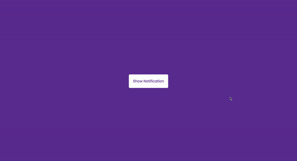

# 50 Projects in 50 Days - Toast Notification

This is a code along project in the [50 Projects In 50 Days - HTML, CSS & JavaScript Udemy Course](https://www.udemy.com/course/50-projects-50-days/). Sharpen your skills by building 50 quick, unique & fun mini projects.

## Table of contents 😌

- [Overview](#overview)
  - [The project](#the-project)
  - [Screenshot](#screenshot)
  - [Links](#links)
- [My process](#my-process)
  - [Built with](#built-with)
  - [What I learned](#what-i-learned)
  - [Continued development](#continued-development)
  - [Code snippets](#im-really-proud-of-these-code-snippets%EF%B8%8F)
  - [Useful resources](#useful-resources)
- [Author](#author)
- [Acknowledgments](#acknowledgments)

## Overview👋🏾

Welcome to the 27<sup>th</sup> mini-project of the course!

### The project😥

In this project users will be able to:

- Build a responsive site that displays various toast notifications.

### Screenshot🌇



### Links👩🏾‍💻

- Live Site URL: (https://jolly-trifle-7f8e0a.netlify.app/)

## My process💭

This is a simple project that I started by marking out initial structure, classes, and id's in HTML. Next I finalized the UI by styling the CSS. I then added functionality by way of JavaScript to randomly display toast notifications, with random styles when the user clicks the button.

### Built with👷🏾‍♀️

- Semantic HTML5 markup
- CSS custom properties
- Flexbox
- JavaScript

### What I learned👩🏾‍🏫

I learned how to create toast notificatons and how to display them dynamically.

### Continued development🔮

In the future I plan on using this knowledge to notify users on the contact page of my portfolio to alert them that their message was successfully (or not) sent.

### I'm really proud of these code snippets✂️

```js
function createNotification(message = null, type = null) {
    const notif = document.createElement('div')
    notif.classList.add('toast')
    notif.classList.add(type ? type : getRandomType())

    notif.innerText = message ? message : getRandomMessage()

    toasts.appendChild(notif)

    setTimeout(() => {
        notif.remove()
    }, 3000);
}
```

### Useful resources📖

- [Resource](https://www.freecodecamp.org/news/how-to-write-better-git-commit-messages/) - This is an amazing article which helped me write better commit messages. I'd recommend it to anyone still learning this concept.

## Author🔎

- Website - [Portfolio Site](https://maiannethornton.netlify.app/)
- Frontend Mentor - [@MaianneThornton](https://www.frontendmentor.io/profile/MaianneThornton)
- GitHub - [@MaianneThornton](GitHub.com/MaianneThornton)
- Twitter - [@MaianneThornton](https://twitter.com/MaianneThornton)
- LinkedIn - [@MaianneThornton](https://www.linkedin.com/in/maiannethornton/)

## Acknowledgments🙏🏾

Special Thanks go to [Brad Traversy](http://www.traversymedia.com/) and [Florin Pop](http://www.florin-pop.com/) creating the course and making reviewing concepts fun 😊.
